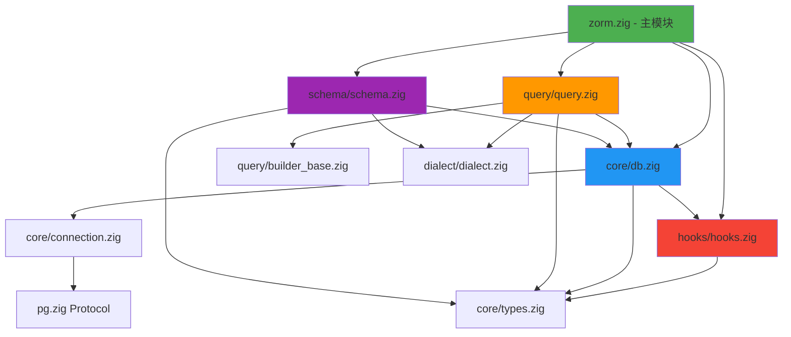
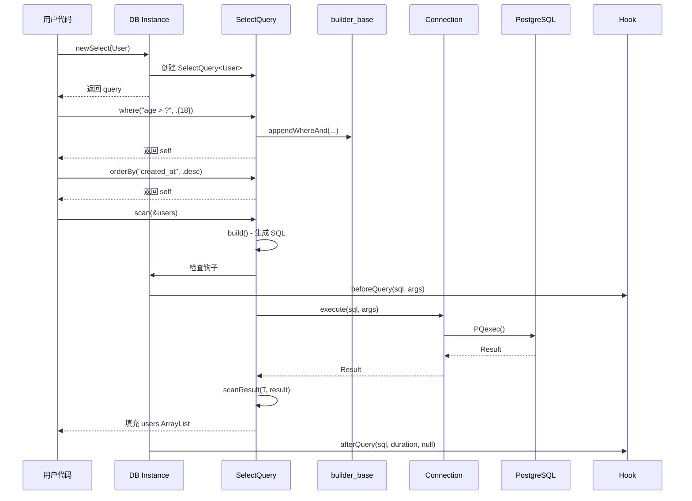
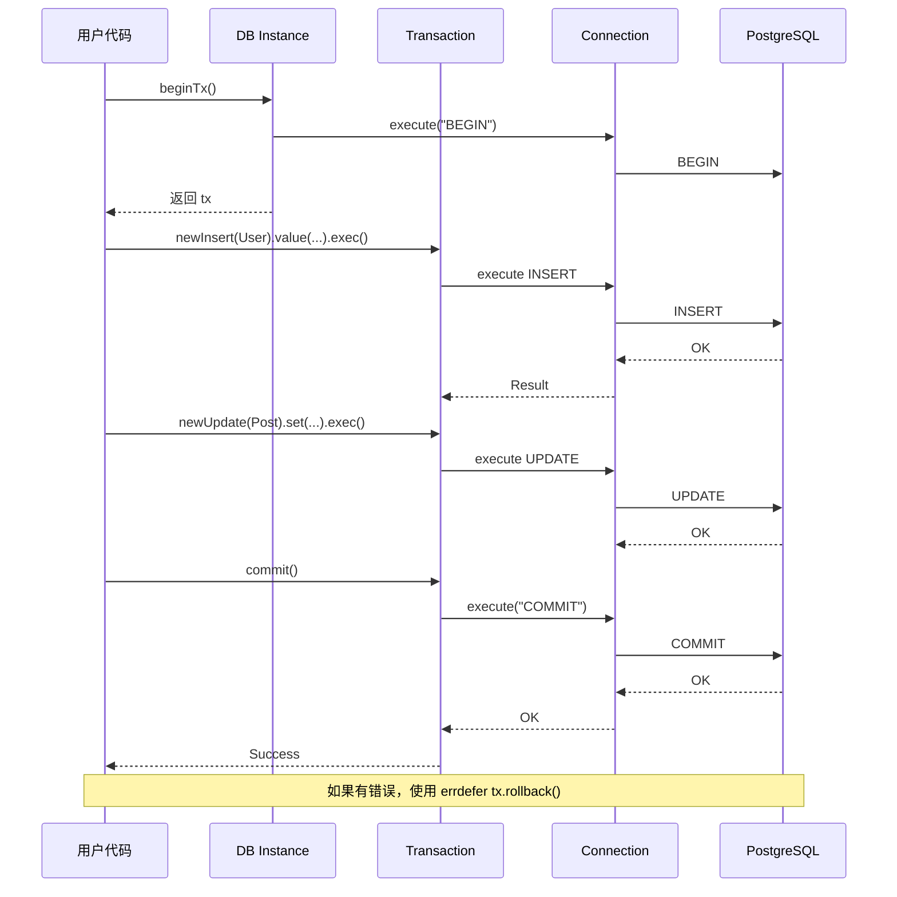

# ZORM 核心架构设计文档

**Version**: v1.0
**Date**: 2025-10-19
**Project**: ZORM - SQL-first Zig ORM for PostgreSQL
**Author**: Winston (Architect)

---

## 文档概述

本文档定义 ZORM 的核心架构设计，包括模块划分、组件关系、数据流和关键设计决策。本文档是 AI 开发代理和架构师的权威参考，确保实现与设计保持一致。

**相关文档**：
- 技术栈选型：[docs/tech-stack.md](./tech-stack.md)
- 编码标准：[docs/coding-standards.md](./coding-standards.md)
- 产品需求：[docs/prd.md](./prd.md)

---

## 高层架构概述

### 架构风格

**单体库架构 (Library Monolith)**

ZORM 是一个独立的 Zig 静态/动态库，采用**分层架构**模式：

```
┌─────────────────────────────────────────────┐
│         用户应用程序 (User Application)        │
└─────────────────┬───────────────────────────┘
                  │ @import("zorm")
                  ↓
┌─────────────────────────────────────────────┐
│           ZORM 公共 API 层                   │
│  (DB, SelectQuery, InsertQuery, etc.)       │
└─────────────────┬───────────────────────────┘
                  │
    ┌─────────────┼─────────────┬──────────────┐
    ↓             ↓             ↓              ↓
┌────────┐  ┌──────────┐  ┌─────────┐  ┌──────────┐
│ Query  │  │  Type    │  │  Hooks  │  │  Schema  │
│Builder │  │  System  │  │  System │  │  Manager │
└────┬───┘  └─────┬────┘  └────┬────┘  └─────┬────┘
     │            │            │             │
     └────────────┴────────────┴─────────────┘
                  │
                  ↓
        ┌──────────────────┐
        │  Database Layer  │
        │     (pg.zig)     │
        └──────────────────┘
                  │
                  ↓
        ┌──────────────────┐
        │   PostgreSQL     │
        └──────────────────┘
```

### 设计原则

1. **SQL-First**: 不隐藏 SQL，提供类型安全的 SQL 构建工具
2. **零运行时开销**: 利用 comptime 在编译时完成类型映射和验证
3. **显式优于隐式**: 内存分配、错误处理都显式可见
4. **与 Bun ORM 对齐**: API 使用方式保持一致，降低学习曲线
5. **PostgreSQL 专注**: 充分利用 PostgreSQL 特性（RETURNING、JSONB、数组）

---

## 模块架构

### 模块依赖图



### 模块清单

| 模块路径 | 职责 | 公开 API | 依赖 |
|---------|------|---------|-----|
| **src/zorm.zig** | 主入口，导出所有公共 API | DB, SelectQuery, InsertQuery, etc. | 所有子模块 |
| **src/core/db.zig** | 数据库实例和连接管理 | DB.init, beginTx, newSelect, etc. | connection, types, hooks |
| **src/core/connection.zig** | PostgreSQL 连接封装 | Conn, Result, Tx 接口 | pg.zig |
| **src/core/types.zig** | 核心类型定义 | QueryArg, InsertResult, etc. | 无 |
| **src/query/query.zig** | 查询构建器 | SelectQuery, InsertQuery, etc. | builder_base, db, dialect, types |
| **src/query/builder_base.zig** | 查询构建共享逻辑 | buildWhereClauses, collectArgs | types |
| **src/dialect/dialect.zig** | 多数据库方言系统 | Dialect enum, placeholder, etc. | 无 (纯 comptime) |
| **src/schema/schema.zig** | Schema 管理和类型映射 | CreateTableQuery, ColumnType | db, dialect |
| **src/hooks/hooks.zig** | 查询生命周期钩子 | QueryHook 接口 | types |

---

## 核心组件设计

### 1. DB (数据库实例)

**职责**：
- 管理数据库连接生命周期
- 提供查询构建器工厂方法
- 事务管理
- 钩子系统管理

**API 设计**：

```zig
pub const DB = struct {
    allocator: Allocator,
    conn: *Connection,
    dialect: Dialect,
    hooks: ?*QueryHook,
    stats: ConnectionStats,

    /// 初始化数据库实例
    pub fn init(allocator: Allocator, conn: *Connection, dialect: Dialect, opts: DBOptions) !DB;

    /// 关闭数据库连接
    pub fn deinit(self: *DB) void;

    /// 创建 SELECT 查询构建器
    pub fn newSelect(self: *DB, comptime T: type) !SelectQuery(T);

    /// 创建 INSERT 查询构建器
    pub fn newInsert(self: *DB, comptime T: type) !InsertQuery(T);

    /// 创建 UPDATE 查询构建器
    pub fn newUpdate(self: *DB, comptime T: type) !UpdateQuery(T);

    /// 创建 DELETE 查询构建器
    pub fn newDelete(self: *DB, comptime T: type) !DeleteQuery(T);

    /// 执行 Raw SQL
    pub fn newRaw(self: *DB, sql: []const u8, args: anytype) !RawQuery;

    /// 开启事务
    pub fn beginTx(self: *DB, opts: TxOptions) !*Tx;

    /// 注册查询钩子
    pub fn addQueryHook(self: *DB, hook: *QueryHook) !void;
};
```

**设计亮点**：
- 单一 DB 实例管理整个连接生命周期
- 查询构建器通过工厂方法创建，确保类型安全
- 钩子系统可选，不影响性能

---

### 2. Query Builders (查询构建器)

**职责**：
- 类型安全的 SQL 生成
- 链式 API 提供流畅的查询体验
- 参数绑定防止 SQL 注入
- 自动从 Zig 类型推断 SQL 类型

**架构模式**：**Builder Pattern + Fluent Interface**

#### SelectQuery

```zig
pub fn SelectQuery(comptime T: type) type {
    return struct {
        const Self = @This();

        allocator: Allocator,
        db: *DB,
        columns: std.ArrayList([]const u8),
        table_name: []const u8,
        where_clauses: std.ArrayList(WhereClause),
        join_clauses: std.ArrayList(JoinClause),
        order_by_clauses: std.ArrayList(OrderByClause),
        group_by_columns: std.ArrayList([]const u8),
        having_clauses: std.ArrayList(HavingClause),
        limit_value: ?usize,
        offset_value: ?usize,
        distinct_value: bool,

        /// 添加 WHERE 条件 (AND)
        pub fn where(self: *Self, condition: []const u8, args: anytype) !*Self;

        /// 添加 WHERE 条件 (OR)
        pub fn whereOr(self: *Self, condition: []const u8, args: anytype) !*Self;

        /// 指定排序
        pub fn orderBy(self: *Self, column: []const u8, direction: OrderDirection) *Self;

        /// 限制结果数量
        pub fn limit(self: *Self, n: usize) *Self;

        /// 偏移量
        pub fn offset(self: *Self, n: usize) *Self;

        /// 选择列
        pub fn column(self: *Self, name: []const u8) !*Self;

        /// 启用 DISTINCT
        pub fn setDistinct(self: *Self) *Self;

        /// JOIN
        pub fn leftJoin(self: *Self, table: []const u8, condition: []const u8) !*Self;

        /// 构建 SQL (不执行)
        pub fn build(self: *Self) ![]const u8;

        /// 执行查询并扫描到 ArrayList
        pub fn scan(self: *Self, dest: *std.ArrayList(T)) !void;

        /// 执行查询并返回单行
        pub fn scanOne(self: *Self) !T;

        /// 释放资源
        pub fn deinit(self: *Self) void;
    };
}
```

**设计亮点**：
- 泛型类型 `T` 在编译时确定目标结构体
- 链式调用返回 `*Self` 支持流畅 API
- `build()` 和 `scan()` 分离，支持 SQL 预览和调试
- 所有 ArrayList 使用 Zig 0.15.2+ API

#### InsertQuery

```zig
pub fn InsertQuery(comptime T: type) type {
    return struct {
        const Self = @This();

        allocator: Allocator,
        db: *DB,
        table_name: []const u8,
        columns: std.ArrayList([]const u8),
        values_list: std.ArrayList([]const QueryArg),
        returning_columns: ?[]const []const u8,
        on_conflict: ?OnConflictClause,

        /// 插入单行数据
        pub fn value(self: *Self, item: T) !*Self;

        /// 批量插入
        pub fn values(self: *Self, items: []const T) !*Self;

        /// 启用 RETURNING
        pub fn setReturning(self: *Self, cols: []const []const u8) *Self;

        /// ON CONFLICT DO NOTHING
        pub fn onConflict(self: *Self, target: []const u8) *Self;
        pub fn doNothing(self: *Self) *Self;

        /// ON CONFLICT DO UPDATE
        pub fn doUpdate(self: *Self, assignments: []const u8) !*Self;

        /// 执行插入
        pub fn exec(self: *Self) !InsertResult;

        /// 执行插入并返回插入的数据
        pub fn execReturning(self: *Self, dest: *std.ArrayList(T)) !void;

        pub fn deinit(self: *Self) void;
    };
}
```

**设计亮点**：
- `value()` vs `values()` 区分单行和批量插入
- ON CONFLICT 支持完整的 PostgreSQL upsert 语法
- RETURNING 子句集成，避免额外查询

---

### 3. Type System (类型系统)

**职责**：
- Zig 类型到 PostgreSQL 类型的双向映射
- Comptime 类型反射和验证
- 自动表名和列名推断

**核心函数**：

```zig
/// Zig 类型到 SQL 类型映射
pub fn zigToSQLType(comptime T: type) []const u8 {
    return switch (@typeInfo(T)) {
        .Int => |info| {
            if (info.bits == 64) return "BIGINT";
            if (info.bits == 32) return "INTEGER";
            if (info.bits == 16) return "SMALLINT";
            return "INTEGER";
        },
        .Bool => "BOOLEAN",
        .Float => |info| {
            if (info.bits == 64) return "DOUBLE PRECISION";
            return "REAL";
        },
        .Pointer => |info| {
            if (info.child == u8) return "TEXT";
            @compileError("不支持的指针类型: " ++ @typeName(T));
        },
        .Optional => |info| {
            // 可选类型递归映射
            return zigToSQLType(info.child) ++ " NULL";
        },
        else => @compileError("不支持的 Zig 类型: " ++ @typeName(T)),
    };
}

/// 获取表名 (优先使用 struct 的 table_name 声明)
pub fn getTableName(comptime T: type) []const u8 {
    if (@hasDecl(T, "table_name")) {
        return T.table_name;
    }
    // 否则使用类型名的小写形式
    return toLowerSnakeCase(@typeName(T));
}

/// 反射结构体字段
pub fn getFields(comptime T: type) []const std.builtin.Type.StructField {
    const type_info = @typeInfo(T);
    if (type_info != .Struct) {
        @compileError(@typeName(T) ++ " 不是结构体类型");
    }
    return type_info.Struct.fields;
}
```

**设计亮点**：
- 完全在 comptime 执行，零运行时开销
- 清晰的错误消息指导用户修正类型问题
- 支持可选类型 (`?T`) 自动处理 NULL

---

### 4. Dialect System (方言系统)

**职责**：
- 抽象不同数据库的 SQL 语法差异
- 提供 comptime 特性检测
- 生成数据库特定的 SQL 片段

**设计**：

```zig
pub const Dialect = enum {
    postgresql,
    mysql,
    sqlite,
    mssql,
    oracle,

    /// 获取占位符格式
    pub fn placeholder(self: Dialect, comptime index: usize) []const u8 {
        return switch (self) {
            .postgresql => comptimePrint("${d}", .{index}),
            .mysql, .sqlite => "?",
            .mssql => comptimePrint("@p{d}", .{index}),
            .oracle => comptimePrint(":{d}", .{index}),
        };
    }

    /// 检查是否支持特性
    pub fn supports(self: Dialect, comptime feature: Feature) bool {
        return switch (feature) {
            .returning => self == .postgresql or self == .mssql or self == .oracle,
            .on_conflict => self == .postgresql or self == .sqlite,
            .jsonb => self == .postgresql,
            .arrays => self == .postgresql,
            .upsert => self != .mysql,
            // ...
        };
    }

    /// 获取标识符引用字符
    pub fn identQuote(self: Dialect) Quote {
        return switch (self) {
            .postgresql, .sqlite => .{ .left = '"', .right = '"' },
            .mysql => .{ .left = '`', .right = '`' },
            .mssql => .{ .left = '[', .right = ']' },
            .oracle => .{ .left = '"', .right = '"' },
        };
    }

    /// 获取 UPSERT 语法
    pub fn upsertClause(self: Dialect) []const u8 {
        return switch (self) {
            .postgresql => "ON CONFLICT",
            .mysql => "ON DUPLICATE KEY UPDATE",
            .sqlite => "ON CONFLICT",
            .mssql => "MERGE",
            .oracle => "MERGE",
        };
    }
};
```

**设计亮点**：
- 纯 comptime 实现，零运行时开销
- 特性检测支持条件编译
- **注意**：ZORM v1.0 仅支持 PostgreSQL，其他方言代码保留用于未来扩展

---

### 5. Schema Manager (Schema 管理器)

**职责**：
- 从 Zig 结构体自动生成 CREATE TABLE 语句
- 支持自定义约束和索引
- 提供 DDL 查询构建器

**API 设计**：

```zig
pub fn CreateTableQuery(comptime T: type) type {
    return struct {
        const Self = @This();

        allocator: Allocator,
        db: *DB,
        table_name: []const u8,
        if_not_exists_flag: bool,

        /// 添加 IF NOT EXISTS
        pub fn ifNotExists(self: *Self) *Self;

        /// 构建 CREATE TABLE SQL
        pub fn build(self: *Self) ![]const u8;

        /// 执行 DDL
        pub fn exec(self: *Self) !void;

        pub fn deinit(self: *Self) void;
    };
}

pub fn CreateIndexQuery(comptime T: type) type {
    return struct {
        // 类似 CreateTableQuery
        pub fn index(self: *Self, name: []const u8) *Self;
        pub fn column(self: *Self, col: []const u8) !*Self;
        pub fn unique(self: *Self) *Self;
        pub fn where(self: *Self, condition: []const u8) !*Self;
    };
}
```

**自定义 Schema 配置**：

```zig
const User = struct {
    id: i64,
    username: []const u8,
    email: []const u8,
    age: u32,
    created_at: i64,

    pub const table_name = "users";

    // Schema 配置 (comptime)
    pub const schema = .{
        .id = .{ .primary_key = true, .auto_increment = true },
        .username = .{ .unique = true, .sql_type = "VARCHAR(50)" },
        .email = .{ .unique = true },
        .age = .{ .check = "age >= 0 AND age <= 150" },
        .created_at = .{ .default = "CURRENT_TIMESTAMP" },
    };
};
```

---

### 6. Hooks System (钩子系统)

**职责**：
- 查询生命周期拦截
- 日志记录和性能追踪
- 可观测性支持

**接口设计**：

```zig
pub const QueryHook = struct {
    beforeQuery: ?*const fn (sql: []const u8, args: []const QueryArg) anyerror!void,
    afterQuery: ?*const fn (sql: []const u8, duration_ns: i64, err: ?anyerror) anyerror!void,
};

/// 日志钩子示例
pub const LoggingHook = struct {
    pub fn beforeQuery(sql: []const u8, args: []const QueryArg) !void {
        std.debug.print("[SQL] {s}\n", .{sql});
        std.debug.print("[ARGS] {any}\n", .{args});
    }

    pub fn afterQuery(sql: []const u8, duration_ns: i64, err: ?anyerror) !void {
        const duration_ms = @as(f64, @floatFromInt(duration_ns)) / 1_000_000.0;
        if (err) |e| {
            std.debug.print("[ERROR] Query failed: {}\n", .{e});
        } else {
            std.debug.print("[TIMING] {d:.2}ms\n", .{duration_ms});
        }
    }

    pub fn hook(self: *LoggingHook) QueryHook {
        return .{
            .beforeQuery = beforeQuery,
            .afterQuery = afterQuery,
        };
    }
};
```

---

## 数据流和工作流程

### 典型查询流程 (SELECT)



### 事务流程



---

## 项目目录结构

```
zorm/
├── build.zig                  # Zig 构建配置
├── build.zig.zon              # 包元数据 (可选)
├── README.md                  # 项目说明
├── LICENSE                    # 开源许可证
├── .gitignore                 # Git 忽略文件
├── .github/
│   └── workflows/
│       ├── ci.yml             # CI/CD 流程
│       └── release.yml        # 发布流程
├── src/
│   ├── zorm.zig               # 主模块入口
│   ├── core/
│   │   ├── db.zig             # DB 实例管理
│   │   ├── connection.zig     # PostgreSQL 连接封装
│   │   └── types.zig          # 核心类型定义
│   ├── query/
│   │   ├── query.zig          # 查询构建器
│   │   └── builder_base.zig   # 查询构建共享逻辑
│   ├── dialect/
│   │   └── dialect.zig        # 数据库方言系统
│   ├── schema/
│   │   └── schema.zig         # Schema 管理
│   └── hooks/
│       └── hooks.zig          # 钩子系统
├── tests/
│   ├── unit/                  # 单元测试
│   │   ├── query_test.zig
│   │   ├── db_test.zig
│   │   └── types_test.zig
│   └── integration/           # 集成测试
│       ├── postgres_test.zig
│       └── transaction_test.zig
├── examples/
│   ├── basic.zig              # 基础 CRUD 示例
│   ├── transaction.zig        # 事务管理示例
│   ├── join.zig               # JOIN 查询示例
│   └── upsert.zig             # ON CONFLICT 示例
├── docs/
│   ├── prd.md                 # 产品需求文档
│   ├── tech-stack.md          # 技术栈文档
│   ├── coding-standards.md    # 编码标准
│   └── architecture-core.md   # 本文档
└── benchmarks/                # 性能基准测试
    ├── insert_bench.zig
    └── select_bench.zig
```

---

## 性能优化策略

### 1. 编译时优化 (Comptime)

- **类型映射**: 所有 Zig → SQL 类型映射在编译时完成
- **SQL 模板**: 静态 SQL 片段编译时生成
- **特性检测**: Dialect 特性检测零运行时开销

### 2. 内存优化

- **Arena Allocator**: 查询构建使用 Arena，统一释放
- **预分配容量**: ArrayList 预分配减少重新分配
- **零拷贝**: 结果扫描尽量避免数据拷贝

### 3. 查询优化

- **批量插入**: 单条 SQL 插入多行
- **RETURNING**: 避免 INSERT 后再 SELECT
- **连接池**: 未来版本支持连接池管理

---

## 安全设计

### 1. SQL 注入防护

- **强制参数绑定**: 所有查询使用占位符 (`$1`, `$2`)
- **禁止字符串拼接**: 编译器警告直接拼接 SQL

### 2. 内存安全

- **显式 Allocator**: 所有内存分配可追踪
- **defer/errdefer**: 确保资源释放
- **测试 Allocator**: 自动检测内存泄漏
- **纯 Zig 实现**: 使用 pg.zig 避免 C FFI 的内存安全隐患

### 3. 类型安全

- **编译时验证**: 不支持的类型触发 `@compileError`
- **强制错误处理**: 返回 `!T` error union
- **原生 Zig 类型**: pg.zig 提供原生类型支持，无需类型转换

---

## 扩展性设计

### 未来扩展方向

1. **连接池管理**
   - 实现高效连接池
   - 支持连接健康检查和自动重连

2. **迁移系统**
   - Schema 版本管理
   - Up/Down 迁移脚本

3. **关系映射**
   - Belongs-To, Has-Many, Many-to-Many
   - 关联查询和预加载

4. **预编译语句缓存**
   - 提升重复查询性能

5. **多数据库支持**
   - 激活 MySQL、SQLite 等方言支持

---

## 测试策略

### 测试金字塔

```
       E2E Tests (5%)
      ───────────────
    Integration Tests (25%)
   ───────────────────────────
 Unit Tests (70%)
─────────────────────────────────
```

### 测试类型

1. **单元测试** (tests/unit/)
   - 每个模块独立测试
   - 使用 `std.testing.allocator` 检测泄漏
   - 覆盖率目标: 80%+

2. **集成测试** (tests/integration/)
   - 真实 PostgreSQL 数据库测试
   - 使用 Docker 容器或本地实例
   - 测试完整查询流程

3. **性能基准测试** (benchmarks/)
   - 对比原生 libpq 性能
   - 目标: 开销 < 5%

---

## 关键设计决策

| 决策 | 选择 | 理由 |
|------|------|------|
| **仅支持 PostgreSQL** | 是 | 集中资源充分利用 PostgreSQL 特性，避免抽象层开销 |
| **Builder Pattern** | 是 | 提供类型安全的链式 API，符合 Bun ORM 风格 |
| **Comptime 类型映射** | 是 | 零运行时开销，编译时验证 |
| **显式 Allocator** | 是 | 符合 Zig 惯例，内存分配可控 |
| **钩子系统** | 可选 | 不影响核心性能，提供可观测性扩展点 |
| **连接池** | v2.0 | v1.0 专注核心功能，连接池延后实现 |

---

## 变更记录

| Date | Version | Change | Author |
|------|---------|--------|--------|
| 2025-10-19 | v1.0 | 初始架构设计 | Winston (Architect) |
| 2025-10-19 | v1.1 | 替换 libpq 为 pg.zig 纯 Zig 驱动,更新架构图和安全设计 | Winston (Architect) |

---

## 参考架构

- **Bun ORM**: API 设计参考
- **SQLx (Rust)**: 编译时 SQL 验证思路
- **GORM (Go)**: 查询构建器模式
- **Zig 标准库**: Allocator 模式和错误处理

---

**架构师签名**: Winston 🏗️
**审核状态**: ✅ Approved for Development
