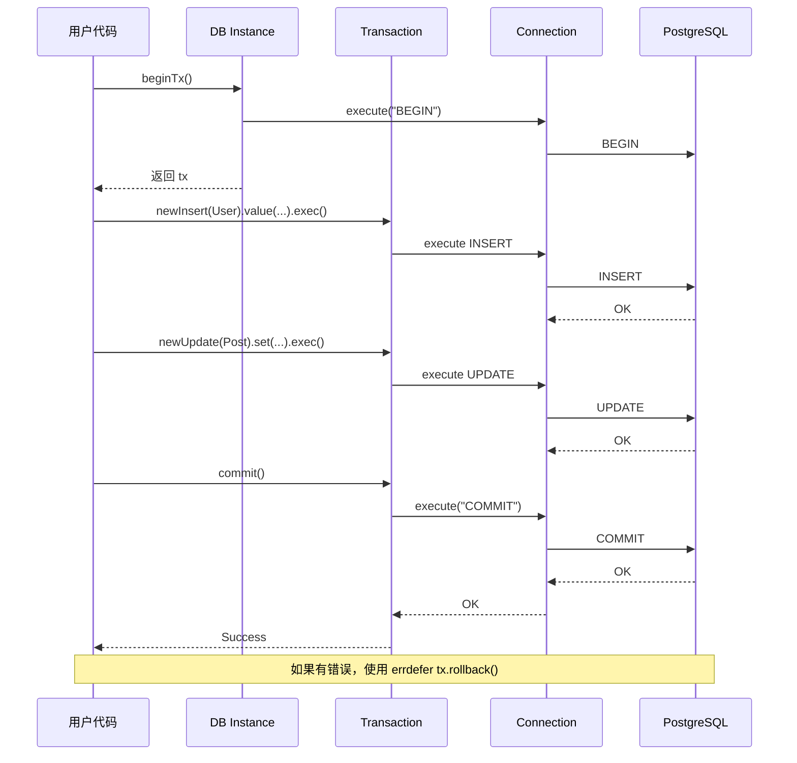

# Story 2.4: Transaction Management API

**Epic**: 2 - Complete CRUD & Transaction Support
**Story**: 2.4
**Status**: Approved

---

## Story

**As a** Zig developer,
**I want** 使用事务管理 API 确保多个数据库操作的原子性,
**so that** 我能够实现复杂业务逻辑并保证数据一致性。

---

## Acceptance Criteria

1. **AC2.4.1**: 提供 `db.beginTx()` 方法开启事务，返回 `*Tx` 事务对象
2. **AC2.4.2**: Tx 对象提供与 DB 相同的查询构建器方法（newSelect、newInsert、newUpdate、newDelete）
3. **AC2.4.3**: 提供 `tx.commit()` 方法提交事务
4. **AC2.4.4**: 提供 `tx.rollback()` 方法回滚事务
5. **AC2.4.5**: 支持 `errdefer tx.rollback()` 模式，错误时自动回滚
6. **AC2.4.6**: 事务内的所有操作共享同一个数据库连接
7. **AC2.4.7**: 嵌套事务检测并返回错误（PostgreSQL 不支持真正的嵌套事务）
8. **AC2.4.8**: 完整使用示例验证事务工作流程

---

## Tasks / Subtasks

- [ ] **Task 1**: 设计 Tx 结构体 (AC: 2.4.1, 2.4.6)
  - [ ] 在 `src/core/db.zig` 中定义 `Tx` 结构体
  - [ ] 包含字段：
    - `allocator: Allocator`
    - `conn: *Connection` (共享数据库连接)
    - `db: *DB` (引用父 DB 实例)
    - `is_active: bool` (跟踪事务状态)
    - `is_committed: bool` (防止重复提交)
    - `is_rolled_back: bool` (防止重复回滚)
  - [ ] 定义 `TxOptions` 配置结构体（为 Story 2.5 预留）

- [ ] **Task 2**: 实现 db.beginTx() 方法 (AC: 2.4.1, 2.4.7)
  - [ ] 在 `DB` 中添加 `beginTx(self: *DB, opts: TxOptions)` 方法
  - [ ] 检查是否已有活跃事务（检测嵌套）
  - [ ] 如果已有活跃事务，返回 `error.NestedTransaction`
  - [ ] 执行 `BEGIN` SQL 语句
  - [ ] 创建 Tx 实例，共享当前连接
  - [ ] 设置 `is_active = true`
  - [ ] 返回 `*Tx`

- [ ] **Task 3**: 实现 tx.commit() 方法 (AC: 2.4.3)
  - [ ] 添加 `commit(self: *Tx)` 方法
  - [ ] 检查事务状态：
    - 如果 `!is_active`，返回 `error.TransactionNotActive`
    - 如果 `is_committed`，返回 `error.AlreadyCommitted`
    - 如果 `is_rolled_back`，返回 `error.AlreadyRolledBack`
  - [ ] 执行 `COMMIT` SQL 语句
  - [ ] 设置 `is_active = false`, `is_committed = true`
  - [ ] 释放事务资源（但不关闭连接）

- [ ] **Task 4**: 实现 tx.rollback() 方法 (AC: 2.4.4, 2.4.5)
  - [ ] 添加 `rollback(self: *Tx)` 方法
  - [ ] 检查事务状态：
    - 如果 `!is_active`，返回 `error.TransactionNotActive`
    - 如果 `is_committed`，返回 `error.AlreadyCommitted`
    - 如果 `is_rolled_back`，直接返回（幂等）
  - [ ] 执行 `ROLLBACK` SQL 语句
  - [ ] 设置 `is_active = false`, `is_rolled_back = true`
  - [ ] 释放事务资源

- [ ] **Task 5**: Tx 对象提供查询构建器方法 (AC: 2.4.2)
  - [ ] 在 `Tx` 中实现 `newSelect(comptime T: type)` 方法
  - [ ] 在 `Tx` 中实现 `newInsert(comptime T: type)` 方法
  - [ ] 在 `Tx` 中实现 `newUpdate(comptime T: type)` 方法
  - [ ] 在 `Tx` 中实现 `newDelete(comptime T: type)` 方法
  - [ ] 所有查询使用事务的共享连接
  - [ ] 复用 DB 的查询构建器实现，传递 Tx 连接

- [ ] **Task 6**: 实现连接共享机制 (AC: 2.4.6)
  - [ ] 确保事务内所有查询使用同一个 `conn`
  - [ ] 修改查询构建器 `exec()` 方法支持 Tx 连接
  - [ ] 事务内查询不释放连接
  - [ ] commit/rollback 后释放连接锁定（如果有连接池）

- [ ] **Task 7**: 实现嵌套事务检测 (AC: 2.4.7)
  - [ ] 在 `DB` 中添加 `active_tx: ?*Tx` 字段
  - [ ] `beginTx()` 时检查 `active_tx` 是否为 null
  - [ ] 如果非 null，返回 `error.NestedTransaction`
  - [ ] `commit()` 或 `rollback()` 后设置 `active_tx = null`
  - [ ] 添加文档说明：PostgreSQL 不支持真正的嵌套事务，使用 SAVEPOINT 在 v2.0

- [ ] **Task 8**: 实现 errdefer 支持 (AC: 2.4.5)
  - [ ] 确保 `rollback()` 幂等（多次调用不报错）
  - [ ] 提供清晰的文档示例说明 errdefer 用法
  - [ ] 测试 errdefer 自动回滚场景

- [ ] **Task 9**: 实现 Tx.deinit() 资源清理
  - [ ] 添加 `deinit(self: *Tx)` 方法
  - [ ] 检查事务是否已提交或回滚
  - [ ] 如果仍 active，自动执行 `rollback()`（安全默认）
  - [ ] 释放事务对象内存
  - [ ] 设置 `db.active_tx = null`

- [ ] **Task 10**: 编写单元测试
  - [ ] 创建 `tests/unit/transaction_test.zig`
  - [ ] 测试 beginTx() 创建事务
  - [ ] 测试 commit() 正常提交
  - [ ] 测试 rollback() 正常回滚
  - [ ] 测试嵌套事务检测（应返回错误）
  - [ ] 测试重复 commit/rollback（应返回错误）
  - [ ] 测试 errdefer 自动回滚
  - [ ] 测试内存泄漏

- [ ] **Task 11**: 编写集成测试
  - [ ] 创建 `tests/integration/transaction_test.zig`
  - [ ] 测试事务中的 INSERT + SELECT
  - [ ] 测试事务 COMMIT 数据持久化
  - [ ] 测试事务 ROLLBACK 数据未持久化
  - [ ] 测试事务中的 UPDATE + DELETE
  - [ ] 测试错误时自动回滚（errdefer）
  - [ ] 测试多个查询共享连接

- [ ] **Task 12**: 创建示例程序 (AC: 2.4.8)
  - [ ] 创建 `examples/transaction.zig`
  - [ ] 演示基本事务流程（BEGIN → INSERT → COMMIT）
  - [ ] 演示 errdefer 自动回滚
  - [ ] 演示事务中执行多个操作
  - [ ] 演示 ROLLBACK 场景
  - [ ] 添加最佳实践注释

- [ ] **Task 13**: 错误处理和边界情况
  - [ ] 定义事务相关错误类型：
    - `error.NestedTransaction`
    - `error.TransactionNotActive`
    - `error.AlreadyCommitted`
    - `error.AlreadyRolledBack`
  - [ ] 处理连接断开时的事务状态
  - [ ] 处理长事务超时场景

---

## Dev Notes

### 架构参考

**事务设计** [Source: architecture/architecture-core.md#Transaction Flow]:
- 事务生命周期：BEGIN → 操作 → COMMIT/ROLLBACK
- 所有操作必须在同一连接上执行
- 错误时使用 errdefer 自动回滚
- PostgreSQL 不支持真正的嵌套事务（SAVEPOINT 延后实现）

**连接管理** [Source: architecture/architecture-core.md#Connection Management]:
- 事务内所有查询共享同一个 Connection
- commit/rollback 后释放连接（但不关闭）
- 未来版本支持连接池管理

**安全设计** [Source: architecture/architecture-core.md#Security Design]:
- 事务未提交且未回滚时，deinit() 自动回滚（防止数据不一致）
- 嵌套事务检测防止意外行为
- 重复 commit/rollback 检测防止逻辑错误

### 事务流程图



### 实现细节

**事务状态管理**:
```zig
pub const Tx = struct {
    allocator: Allocator,
    conn: *Connection,
    db: *DB,
    is_active: bool,
    is_committed: bool,
    is_rolled_back: bool,

    pub fn commit(self: *Tx) !void {
        if (!self.is_active) return error.TransactionNotActive;
        if (self.is_committed) return error.AlreadyCommitted;
        if (self.is_rolled_back) return error.AlreadyRolledBack;

        try self.conn.execute("COMMIT", .{});
        self.is_active = false;
        self.is_committed = true;
        self.db.active_tx = null;
    }

    pub fn rollback(self: *Tx) !void {
        if (!self.is_active) return; // 幂等
        if (self.is_committed) return error.AlreadyCommitted;
        if (self.is_rolled_back) return; // 幂等

        try self.conn.execute("ROLLBACK", .{});
        self.is_active = false;
        self.is_rolled_back = true;
        self.db.active_tx = null;
    }

    pub fn deinit(self: *Tx) void {
        if (self.is_active) {
            self.rollback() catch {}; // 安全默认：自动回滚
        }
    }
};
```

**嵌套事务检测**:
```zig
pub fn beginTx(self: *DB, opts: TxOptions) !*Tx {
    if (self.active_tx) |_| {
        return error.NestedTransaction;
    }

    try self.conn.execute("BEGIN", .{});

    const tx = try self.allocator.create(Tx);
    tx.* = Tx{
        .allocator = self.allocator,
        .conn = self.conn,
        .db = self,
        .is_active = true,
        .is_committed = false,
        .is_rolled_back = false,
    };

    self.active_tx = tx;
    return tx;
}
```

### Bun ORM 对齐

**API 一致性** [Source: prd.md#Background Context]:
```zig
// ZORM (Zig)
const tx = try db.beginTx();
errdefer tx.rollback() catch {}; // 错误时自动回滚

// 在事务中插入用户
var insert_user = try tx.newInsert(User);
defer insert_user.deinit();

var inserted: std.ArrayList(User) = .{};
defer inserted.deinit(allocator);

try insert_user
    .value(user)
    .setReturning("*")
    .execReturning(&inserted);

if (inserted.items.len == 0) {
    try tx.rollback();
    return error.InsertFailed;
}

// 插入关联的文章
const post = Post{
    .user_id = inserted.items[0].id,
    .title = "My First Post",
    .content = "Hello, World!",
    .created_at = std.time.timestamp(),
};

var insert_post = try tx.newInsert(Post);
defer insert_post.deinit();

_ = try insert_post.value(post).exec();

// 提交事务
try tx.commit();

// Bun ORM (TypeScript)
const tx = await db.beginTx();

try {
    const user = await tx.insert(User).values({ ... }).returning("*");
    if (!user) throw new Error("Insert failed");

    await tx.insert(Post).values({
        userId: user.id,
        title: "My First Post",
        content: "Hello, World!"
    });

    await tx.commit();
} catch (err) {
    await tx.rollback();
    throw err;
}
```

### 项目结构

**修改文件**:
- `src/core/db.zig` - 添加 Tx 结构体和 beginTx() 方法
- `src/core/db.zig` - 添加 active_tx 字段跟踪活跃事务
- `src/core/types.zig` - 定义 TxOptions 结构体
- `src/zorm.zig` - 导出 Tx 和 TxOptions

**新增文件**:
- `tests/unit/transaction_test.zig` - 事务单元测试
- `tests/integration/transaction_test.zig` - 事务集成测试
- `examples/transaction.zig` - 事务示例程序

### Testing

**测试标准** [Source: architecture/coding-standards.md#测试规范]:
- **测试文件位置**: `tests/unit/transaction_test.zig`
- **测试命名**: `test "Transaction: {描述性名称}"`
- **内存泄漏检测**: 使用 `std.testing.allocator`
- **覆盖率目标**: ≥ 80%

**关键测试场景**:
1. **正常流程**: BEGIN → INSERT → COMMIT → 数据持久化
2. **回滚流程**: BEGIN → INSERT → ROLLBACK → 数据未持久化
3. **errdefer 回滚**: BEGIN → INSERT → 错误 → 自动 ROLLBACK
4. **嵌套事务检测**: beginTx() → beginTx() → error.NestedTransaction
5. **重复操作检测**: commit() → commit() → error.AlreadyCommitted
6. **连接共享**: 事务内多个查询使用同一连接

**集成测试场景**:
- 真实 PostgreSQL 事务提交
- 真实 PostgreSQL 事务回滚
- 并发事务（如果支持连接池）
- 长事务超时处理

### 错误处理

**事务相关错误** [Source: architecture/coding-standards.md#错误处理]:
```zig
pub const ZormError = error{
    NestedTransaction,      // 嵌套事务不支持
    TransactionNotActive,   // 事务未激活
    AlreadyCommitted,       // 已提交
    AlreadyRolledBack,      // 已回滚
    // ... 其他错误
};
```

### 性能考虑

**事务开销** [Source: architecture/architecture-core.md#Performance Optimization]:
- 事务有网络往返开销（BEGIN/COMMIT/ROLLBACK）
- 长事务可能导致锁等待
- 建议：保持事务尽可能短
- 批量操作尽量在单个事务中

---

## Change Log

| Date | Version | Description | Author |
|------|---------|-------------|--------|
| 2025-10-19 | v1.0 | 初始故事创建 | Bob (Scrum Master) |

---

## Dev Agent Record

_(此部分由开发代理在实现时填充)_

### Agent Model Used

_(待填充)_

### Debug Log References

_(待填充)_

### Completion Notes

_(待填充)_

### File List

_(待填充)_

---

## QA Results

_(此部分由 QA 代理填充)_
