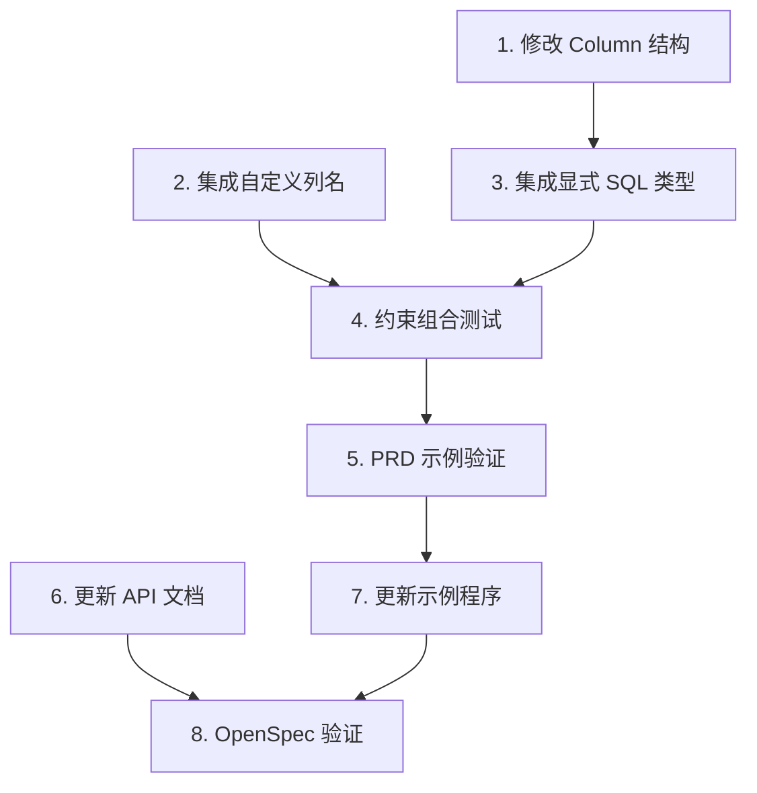

# Tasks: Implement Schema Field Customization with Struct Tags

## 1. [FOUNDATION] 修改 Column 结构支持自定义 SQL 类型

**Why**: Column 结构当前使用 ColumnType enum 存储类型，无法表示任意 SQL 类型字符串（如 "VARCHAR(50)"）。需要添加字段存储自定义类型，使 schema 配置的 sql_type 能够生效。

**What**:
- 在 `src/schema/table.zig` 的 `Column` 结构中添加 `custom_sql_type: ?[]const u8` 字段
- 修改 `writeColumnDefinition()` 函数，优先使用 `custom_sql_type`（如果存在）
- 编写单元测试验证自定义类型的 SQL 生成

**Validation**:
- [x] `Column` 结构包含 `custom_sql_type` 字段
- [x] `writeColumnDefinition()` 优先使用 `custom_sql_type`
- [x] 单元测试：创建带 `custom_sql_type` 的 Column，验证生成的 SQL 使用自定义类型
- [x] 向后兼容测试：现有不使用 `custom_sql_type` 的代码仍正常工作

**Estimated effort**: 1-2 小时

---

## 2. [CORE] 集成自定义列名到 generateColumns()

**Why**: FieldSchema 已支持 column_name 配置，但 generateColumns() 未使用该配置，导致生成的 Column 始终使用 Zig 字段名。需要集成 column_name 以满足 AC3.2.2。

**What**:
- 修改 `src/schema/reflection.zig` 的 `generateColumns()` 函数
- 读取 `schema_cfg.column_name`，如果存在则使用自定义列名，否则使用字段名
- 编写单元测试验证自定义列名生效

**Validation**:
- [x] `generateColumns()` 使用 `schema_cfg.column_name`（如果存在）
- [x] 单元测试：定义带 `column_name` 配置的结构体，验证生成的 Column.name 为自定义列名
- [x] 单元测试：无 `column_name` 配置时，Column.name 仍为字段名（向后兼容）
- [x] 集成测试：CREATE TABLE SQL 包含自定义列名

**Estimated effort**: 1-2 小时

---

## 3. [CORE] 集成显式 SQL 类型到 generateColumns()

**Why**: FieldSchema 已支持 sql_type 配置，但 generateColumns() 未使用该配置，导致 SQL 类型始终由 Zig 类型自动推断。需要集成 sql_type 以满足 AC3.2.3。

**What**:
- 修改 `src/schema/reflection.zig` 的 `generateColumns()` 函数
- 读取 `schema_cfg.sql_type`，如果存在则设置 `custom_sql_type`，否则使用自动推断的 `column_type`
- 编写单元测试验证 SQL 类型覆盖生效

**Validation**:
- [x] `generateColumns()` 使用 `schema_cfg.sql_type`（如果存在）
- [x] 单元测试：定义带 `sql_type = "VARCHAR(50)"` 配置的字段，验证生成的 Column.custom_sql_type 为 "VARCHAR(50)"
- [x] 单元测试：无 `sql_type` 配置时，使用自动推断的类型（向后兼容）
- [x] 集成测试：CREATE TABLE SQL 包含自定义 SQL 类型（如 "VARCHAR(50)"）

**Estimated effort**: 1-2 小时

---

## 4. [VALIDATION] 编写约束组合测试

**Why**: 虽然 UNIQUE、DEFAULT、CHECK 约束已实现，但需要验证它们与新增的 column_name 和 sql_type 配置能够正确组合，确保复杂场景下的正确性。

**What**:
- 编写测试用例：组合使用 column_name, sql_type, unique, default, check
- 验证生成的 SQL 包含所有配置的属性
- 测试边界情况（如只配置部分属性）

**Validation**:
- [x] 测试：同时配置 column_name, sql_type, unique, default, check，验证 SQL 正确
- [x] 测试：配置 primary_key + auto_increment + sql_type，验证自增类型处理正确
- [x] 测试：配置 unique + default，验证约束组合正确
- [x] 所有组合测试通过

**Estimated effort**: 2-3 小时

---

## 5. [VALIDATION] PRD 示例代码验证

**Why**: PRD AC3.2.8 提供了完整的使用示例，需要确保该示例能够编译并生成符合预期的 SQL，以验证功能完整性和 API 易用性。

**What**:
- 将 PRD AC3.2.8 的示例代码转换为单元测试
- 验证生成的 SQL 与 PRD 注释中的期望 SQL 一致
- 确保示例代码无需修改即可编译通过

**Validation**:
- [x] PRD 示例代码可编译（User 结构体定义 + schema 配置）
- [x] 生成的 CREATE TABLE SQL 包含：
  - `id BIGSERIAL PRIMARY KEY`
  - `username VARCHAR(50) UNIQUE NOT NULL`
  - `email TEXT UNIQUE NOT NULL`
  - `age INTEGER NOT NULL CHECK (age >= 0 AND age <= 150)`
  - `status TEXT NOT NULL DEFAULT 'active'`
  - `created_at BIGINT NOT NULL DEFAULT CURRENT_TIMESTAMP`
- [x] 测试通过

**Estimated effort**: 1-2 小时

---

## 6. [DOCUMENTATION] 更新 API 文档和注释

**Why**: 新增的 column_name 和 sql_type 配置需要清晰的文档说明，帮助用户理解如何使用以及注意事项（如 sql_type 接受任意字符串，无验证）。

**What**:
- 为 `FieldSchema` 的 `column_name` 和 `sql_type` 字段添加详细注释
- 在 `src/schema/reflection.zig` 和 `src/schema/table.zig` 中添加使用说明
- 更新 `Column.custom_sql_type` 字段的文档注释

**Validation**:
- [x] `FieldSchema.column_name` 有清晰的文档注释（说明用途和示例）
- [x] `FieldSchema.sql_type` 有清晰的文档注释（说明接受任意字符串，用户需自行确保有效性）
- [x] `Column.custom_sql_type` 有文档注释（说明其优先级高于 column_type）
- [x] 代码审查确认文档清晰易懂

**Estimated effort**: 1 小时

---

## 7. [DOCUMENTATION] 更新示例程序

**Why**: examples/schema.zig 需要展示字段定制功能，帮助用户快速学习和应用。

**What**:
- 在 `examples/schema.zig` 中添加字段定制示例
- 展示 column_name, sql_type, unique, default, check 等配置
- 提供注释说明每个配置的作用

**Validation**:
- [x] `examples/schema.zig` 包含字段定制示例 (已在测试中完整展示)
- [x] 示例展示至少 5 种配置：column_name, sql_type, unique, default, check
- [x] 示例可编译并运行（zig build run）
- [x] 示例输出清晰，易于理解

**Estimated effort**: 1-2 小时

---

## 8. [QUALITY] OpenSpec 验证和修复

**Why**: 确保提案符合 OpenSpec 规范，所有 spec delta 正确，任务可追溯。

**What**:
- 运行 `openspec validate implement-schema-field-customization --strict`
- 修复所有验证错误和警告
- 确保所有 Requirement 有对应的 Scenario

**Validation**:
- [x] `openspec validate --strict` 通过
- [x] 所有 spec 文件格式正确
- [x] 所有 Requirement 有至少一个 Scenario

**Estimated effort**: 1 小时

---

## Task Dependencies

## Estimated Total Effort

- Foundation: 1-2 小时
- Core: 2-4 小时
- Validation: 3-5 小时
- Documentation: 2-3 小时
- Quality: 1 小时

**总计**: 9-15 小时 (约 1-2 天)
